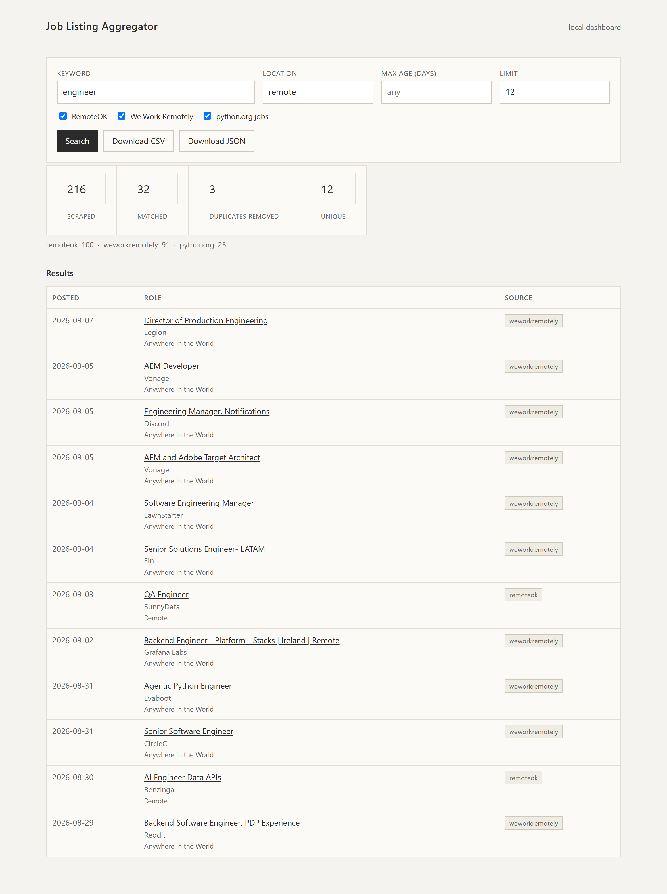

# Job Listing Aggregator

[](https://github.com/NavenduChaturvedi/Job-listing-aggregator/actions/workflows/ci.yml)

[](LICENSE)

A command-line tool that scrapes remote job listings from three sources,
normalises them into one shape, removes duplicates, filters by keyword and
location, and exports clean **CSV + JSON** with a short stats summary.

| Source | Format it exposes | Adapter |
|---|---|---|
| [RemoteOK](https://remoteok.com) | JSON API | [`sources/remoteok.py`](job_aggregator/sources/remoteok.py) |
| [We Work Remotely](https://weworkremotely.com) | RSS / XML feed | [`sources/weworkremotely.py`](job_aggregator/sources/weworkremotely.py) |
| [python.org/jobs](https://www.python.org/jobs/) | server-rendered HTML | [`sources/pythonorg.py`](job_aggregator/sources/pythonorg.py) |

Three different formats on purpose — the point is a small framework, not one
hard-coded scraper. Adding a board is one file plus one line in a registry
(see [DECISIONS.md](DECISIONS.md)).

---

## Features

1. **Scrape** title, company, location, link and posted date from 3 sources
2. **Deduplicate** — by normalised URL, then by title + company (catches the
   same job cross-posted to two boards)
3. **Filter** by keyword (all terms must match title/company/description) and by
   location (with `remote` ⇄ `anywhere`/`worldwide`/… synonyms)
4. **Export** to both `jobs.csv` and `jobs.json`
5. **Stats** — `216 listings scraped / 32 matching / 3 duplicates removed / 20 unique`

Robust by design: `robots.txt` is respected, requests are rate-limited and
backed-off, and one source being down does not stop the others.

---

## Setup

Requires Python 3.10+.

```bash
git clone https://github.com/NavenduChaturvedi/Job-listing-aggregator.git
cd Job-listing-aggregator

python -m venv .venv
# Windows:
.venv\Scripts\activate
# macOS / Linux:
source .venv/bin/activate

pip install -r requirements.txt
```

No accounts, no API keys, no `.env`.

---

## Usage

```bash
# The headline example
python aggregator.py --keyword "python developer" --location "remote"

# Short flags, pick specific sources
python aggregator.py -k react -l remote --source remoteok --source weworkremotely

# Only recent postings, cap the result count, print them to the console
python aggregator.py -k engineer -l remote --max-age-days 21 --limit 50 --print

# Choose where the files go
python aggregator.py -k data --output-dir out --csv data_jobs.csv --json data_jobs.json

# Just show the stats, write nothing
python aggregator.py -k designer --no-export
```

| Flag | Meaning |
|---|---|
| `-k`, `--keyword` | every whitespace-separated term must appear in title/company/description |
| `-l`, `--location` | location substring; `remote` also matches anywhere/worldwide/blank |
| `--source` | restrict to a source (repeatable); default: all three |
| `--max-age-days` | drop listings older than N days (undated listings are kept) |
| `--limit` | keep at most N listings after dedup |
| `--output-dir` / `--csv` / `--json` | where and what to write |
| `--no-export` | report only, do not write files |
| `--print` | also print the listings to the console |

---

## Sample output

```text
$ python aggregator.py --keyword engineer --location remote --limit 20 --print
Scraping sources...
  RemoteOK: 100 listings
  We Work Remotely: 91 listings
  python.org jobs: 25 listings

Sources:
  remoteok        : 100 listings
  weworkremotely  : 91 listings
  pythonorg       : 25 listings

216 listings scraped
32 listings matching keyword "engineer" and location "remote"
3 duplicates removed
20 unique listings

Wrote sample_output/jobs.csv
Wrote sample_output/jobs.json

Top 20 of 20:
  [2026-09-07] Director of Production Engineering @ Legion (Anywhere in the World) - weworkremotely
           https://weworkremotely.com/remote-jobs/legion-director-of-production-engineering
  [2026-09-03] QA Engineer @ SunnyData (Remote) - remoteok
           https://remoteok.com/remote-jobs/remote-qa-engineer-sunnydata-1137300
  ...
```

Full transcript: [sample_output/sample_run.txt](sample_output/sample_run.txt) ·
exports: [jobs.csv](sample_output/jobs.csv), [jobs.json](sample_output/jobs.json).

When a source is unreachable the run still completes:

```text
  RemoteOK: 100 listings
  ! We Work Remotely: HTTP 503
  python.org jobs: 25 listings
  ...
  weworkremotely  : FAILED - HTTP 503
```

### `jobs.json` (one record)

```json
{
  "source": "weworkremotely",
  "title": "Senior Backend Developer (Python)",
  "company": "Proxify AB",
  "location": "Anywhere in the World",
  "posted_date": "2026-08-14",
  "url": "https://weworkremotely.com/remote-jobs/proxify-ab-senior-backend-developer-python-9",
  "tags": ["Back-End Programming"],
  "description": "The Role: We are looking for a Senior Python Developer for one of our clients…"
}
```

---

## Web dashboard (optional)

A small local Flask dashboard over `job_aggregator.runner`: a search form, the
same stats strip, a results table, and CSV / JSON download buttons. Results are
cached for a few minutes so downloading right after a search does not re-scrape.

```bash
pip install -r requirements-web.txt
python -m webapp          # http://127.0.0.1:5001
```



---

## Project layout

```
aggregator.py                CLI entry point (argument parsing only)
job_aggregator/
    config.py               delays / timeouts (env-overridable)
    models.py               the Job record + text/URL/date normalisers
    http.py                 polite fetching: robots.txt, crawl-delay, back-off
    sources/
        base.py             Source base class
        remoteok.py         JSON API adapter
        weworkremotely.py   RSS adapter
        pythonorg.py        HTML adapter
    pipeline.py             dataframe assembly, filter, dedup, stats
    export.py               CSV / JSON serialisation
    runner.py               orchestration for the CLI
webapp/                      optional Flask dashboard (see requirements-web.txt)
tests/                       offline tests + trimmed fixtures
sample_output/               committed example run + exports
```

## Running the tests

```bash
pip install -r requirements-dev.txt
python -m pytest -q
```

## Scheduling (optional next step)

`aggregator.py` is a one-shot command; run it from cron / Task Scheduler to
keep a rolling export, e.g. daily at 08:00:

```cron
0 8 * * *  cd /path/to/repo && .venv/bin/python aggregator.py -k "python" -l remote --output-dir out
```

See [DECISIONS.md](DECISIONS.md) for the reasoning behind every choice.

## License

MIT — see [LICENSE](LICENSE).
